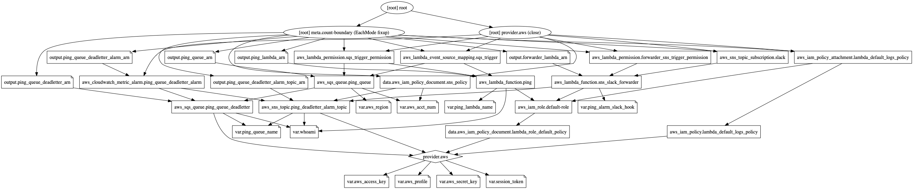

# TL;DR:
This repo sets up a simple Go lambda that is triggered by an SQS queue.  If the lambda fails, the SQS message is sent to a deadletter queue.  When a message gets put on the deadletter queue, a cloudwatch alarm is triggered, which sends an SNS notification to a "notifier" lambda, which then notifies a Slack channel.

## Helper tools
* `get_token.sh`
    * This script will refresh your AWS session token.  It assumes you're using MFA.  If you need to use a simple access key and secret, you'll need to alter this script for that
    * The script will prompt you for the following environment variables if they are not set:
        * `AWS_ROLE_ARN` - the ARN for the role you're trying to assume
        * `AWS_PROFILE` - the name of the profile you want to use, defined in your local `~/.aws/credentials` file
        * `AWS_SESS_NAME` - an arbitrary session name
    * This script requires that the AWS cli tool and `jq` are installed on your machine and accessible in your `PATH`
* `Makefile`
    * `token`
        * This will run `get_token.sh`.  The environment variables listed above _must_ be set beforehand or this make target will fail
    * `lambda` (token required)
        * This will compile the Go main lambda, package it, and push it to aws via the cli
        * A valid session token is required to run this make target
        * The following environment variables must be set to run this make target
            * `WORKER_ARN` - the ARN for the lambda function.  This is made available as an output from the Terraform config, and can be accessed by running `terraform plan`
            * `AWS_REGION` - the aws region where the lambda lives
            * `AWS_PROFILE` - the name of the profile you want to use, defined in your local `~/.aws/credentials` file
            
    * `forwarder` (token required)
        * This will compile the Go forwarder lambda, package it, and push it to aws via the cli
            * `WORKER_ARN` - the ARN for the lambda function.  This is made available as an output from the Terraform config, and can be accessed by running `terraform plan`
            * `AWS_REGION` - the aws region where the lambda lives
            * `AWS_PROFILE` - the name of the profile you want to use, defined in your local `~/.aws/credentials` file
## Terraform vars
Running `make token` will create your session token and create the file `terraform.tfvars`.  Additionally, you need to manually create the file `env.auto.tfvars`.  The file `env.auto.tfvars.txt` exists as a template for this.

## Running this project

Once you've stood up the infrastructure, open the AWS SQS console, and send a message to `ping-queue`.  The message will be forwarded to `ping-lambda`.  If the message body is only the word `pass`, then `ping-lambda` will finish successfully.  Otherwise it will fail.

When `ping-lambda` fails, the message will be retried 5 times before pushing the message to the assigned deadletter queue.

The cloudwatch monitor looks for _any_ messages on the deadletter queue, and will trigger an alarm if there is at least one message in the deadletter queue within the past minute.

Once the alarm is triggered, it sends an SNS message, which in turn triggers the `forwarder` lambda.

Finally, the `forwarder` lambda calls the Slack endpoint

